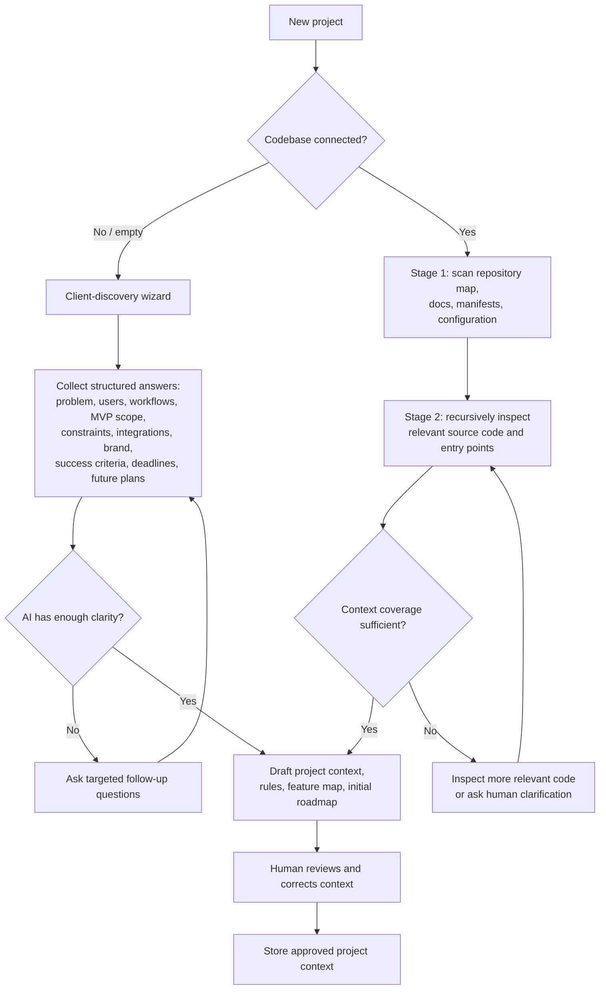
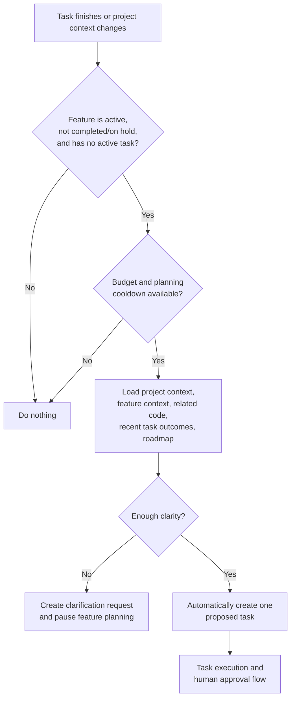

# Axiom activity diagrams — phase 1

## Project initialization

The wizard acts as a real client-discovery process. It asks about the customer's problem, target users, workflows, desired MVP outcome, integrations, technical constraints, brand, approval boundaries, deadline, and future plans. It does not merely ask, “What project do you want?”

For an existing codebase, Axiom begins with repository metadata but progressively reads relevant code until it has sufficient evidence. Small repositories can be read almost entirely; generated files, dependencies, binaries, build output, and secrets are excluded. Each context summary retains its source files and content hashes.

## Automatic feature-planning loop

Feature status controls whether planning may continue:

- `active` — Axiom can propose the next bounded task automatically.
- `needs_clarification` — planning pauses for a human answer.
- `on_hold` — the human has paused the feature.
- `completed` — the human considers the feature done.

A task is considered active while it is proposed, queued, running, under review, or waiting for approval. This prevents duplicate task proposals. A project-level roadmap reassessment runs automatically after a small configurable number of approved tasks, or when all active features are idle.
