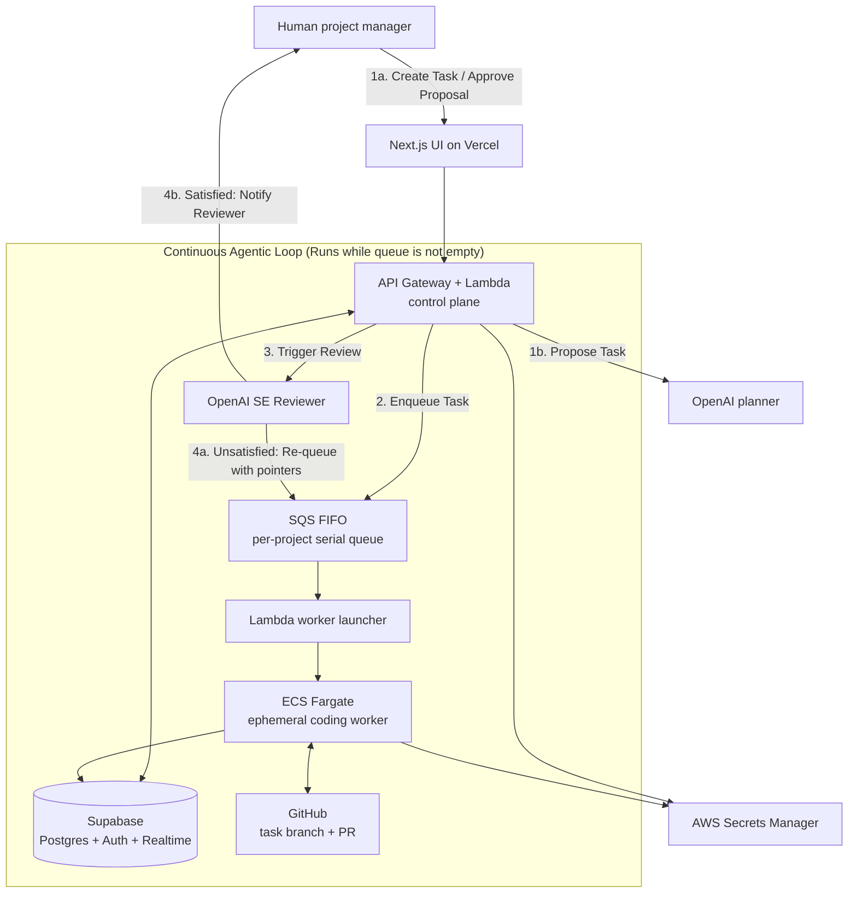

# Axiom architecture

## Recommended MVP architecture



### Why this split

- **Vercel** is ideal for the presentation-quality frontend and fast preview deployments.
- **Lambda** implements short-lived authenticated API actions: context ingestion, planning, dispatch, status updates, and approval.
- **Fargate** fits an agent that may run tools and tests for several minutes; it is deleted after each task.
- **Supabase** owns product data, authentication, realtime task updates, and durable audit records.
- **GitHub** remains the source of truth for code and the review surface for diffs.

For the first demo, create only one ECS task definition, one queue, one user, and one repository. Do not introduce Step Functions, a vector database, or a microservice boundary unless a working vertical slice requires it.

## Context model

The planner should see code, but not the entire repository by default. Give it a small, explicit context packet:

```text
system policy
  + project summary (root)
  + relevant feature summary (level 1)
  + repository tree and selected file excerpts (level -1 / level 2)
  + current request and human instructions
  = one bounded task proposal
```

Model the original three-level idea as durable context nodes:

| Node | Purpose | Typical content |
| --- | --- | --- |
| `repository_map` (level -1) | Orientation | path tree, languages, package manager, test commands |
| `project` (root) | Product truth | goal, architecture, constraints, conventions |
| `feature` (level 1) | Scoped product context | behavior, APIs, ownership, relevant directories |
| `file_anchor` (level 2) | Grounding | path, concise notes, hash, optional bounded excerpt |

Each task stores the IDs and content hashes of the context nodes used to plan it. The worker separately reads only the task's allowed files plus the minimum nearby files needed to compile or test. This makes context selection inspectable and prevents a one-week MVP from becoming a retrieval project.

## Minimal data model

| Table | Key fields |
| --- | --- |
| `projects` | `id`, `owner_id`, `repo_url`, `default_branch`, `budget_cap_cents`, `settings` |
| `context_nodes` | `id`, `project_id`, `parent_id`, `kind`, `path`, `summary`, `content_hash`, `metadata` |
| `requests` | `id`, `project_id`, `body`, `instructions`, `created_by` |
| `tasks` | `id`, `request_id`, `project_id`, `state`, `objective`, `allowed_paths`, `acceptance_criteria`, `validation_commands`, `branch_name`, `commit_sha` |
| `task_runs` | `id`, `task_id`, `worker_image`, `started_at`, `finished_at`, `exit_code`, `report`, `estimated_cost_cents` |
| `reviews` | `id`, `task_id`, `verdict`, `summary`, `risks`, `evidence`, `model` |
| `events` | `id`, `project_id`, `task_id`, `actor_type`, `event_type`, `payload`, `created_at` |

Use Postgres row-level security keyed to `owner_id`. Store logs as bounded text or object-storage references; do not put unbounded raw terminal output into a realtime table.

## Planner contract

Require structured output. A planner response must validate against this shape before any task can be dispatched:

```json
{
  "objective": "string",
  "rationale": "string",
  "allowed_paths": ["string"],
  "implementation_steps": ["string"],
  "validation_commands": ["string"],
  "acceptance_criteria": ["string"],
  "questions_or_blockers": ["string"],
  "estimated_cost_usd": 0
}
```

Reject a proposal if it has no allowed paths, asks for secrets in its free text, contains unsafe shell commands, or lacks acceptance criteria. A blocker should return to the human; the agent must not create an external account or request a secret in an unstructured prompt.

## Worker contract

1. Receive a signed run identifier, not broad database credentials.
2. Fetch a short-lived GitHub installation token and the specific task payload.
3. Clone to an empty ephemeral workspace and create `axiom/task-<id>`.
4. Read the task contract and allowed code context.
5. Make the requested change, run allowlisted validation commands, commit, and push the branch.
6. Submit changed paths, commit SHA, test output, and a concise report.
7. Exit; ECS destroys the task filesystem.

The worker must fail if it changes a path outside `allowed_paths` (except a small, declared set such as lockfiles), exceeds its wall-clock limit, or cannot supply a commit and evidence.

## Security posture: honest MVP boundary

The word **secure** in the pitch means *ephemeral execution, least-privilege credentials, constrained actions, and human approval*. It must not imply that an LLM has been perfectly sandboxed.

- Run each worker as a non-root Linux user with a read-only image, bounded CPU/memory, and a strict timeout.
- Give its task role only permission to fetch the secret and report for its own run. No production database credentials, no AWS administrator role, and no deployment permission.
- Use a GitHub App installation token limited to the selected repository; protect the default branch and require review.
- Keep model/API keys in Secrets Manager or provider-managed environment variables. Redact them from logs and prompts.
- Capture an append-only event trail for dispatch, worker start/finish, review, and human decision.
- Do not claim egress allowlisting until it is actually configured. For the MVP, the worker needs outbound access to GitHub and its model provider, so use least privilege and never give it production secrets.

## State and concurrency rules

- **Continuous Agentic Execution Loop**: The worker execution loop runs continuously as long as there is a task waiting in the project's execution queue.
- **Dual Task Creation Paths**: 
  - *Proposed Tasks*: The AI planner proposes a task to the human, who reviews and dispatches it to the queue.
  - *Direct Tasks*: The human creates a task directly (e.g., direct instructions), bypassing the planning stage and enqueuing it immediately.
- **SE Reviewer & Retry Loop**: 
  - When the worker finishes a task, the Software Engineer (SE) reviewer agent automatically inspects the code changes, preview deployment, and test evidence.
  - *Satisfied*: The SE reviewer marks the task as `waiting_for_approval` and sends the report to the human.
  - *Unsatisfied*: The SE reviewer automatically places the task back into the execution queue (re-enqueues it) along with specific pointers and feedback detailing the failure or necessary revisions, triggering an automatic retry without bothering the human manager.
- **State Atomicity**: The database transition, queue enqueue, and `running` claim must be atomic and idempotent.
- **Concurrency Cap**: Enforce a unique partial constraint: at most one `running` task per project at any given time.
- **SQS Serialization**: Use SQS FIFO with `project_id` as the message group ID; this serializes each project without blocking future multi-project support.
- **Watchdog Recovery**: A watchdog moves expired `running` tasks to `failed` or triggers a retry/escalation, then releases the project lock.

## Deployment and Live Inspection

To allow the human reviewer to inspect the live application's behavior before approving the branch, the system avoids manual code reviews in favor of visual verification:

1. **Vercel Preview Deployments**:
   - When the coding worker pushes a task branch to GitHub, Vercel automatically builds and deploys an isolated preview site.
   - Axiom fetches this unique preview URL via GitHub's Deployments API or Vercel's API.
   - The URL is shown directly in the Axiom UI so the reviewer can interact with the live changes.

2. **Sequential Queue Staging DB Safety**:
   - Because Axiom serializes runs (at most one running/reviewing task per project at any time), a single staging database or staging schema can be modified by migrations on the task branch without causing database conflicts or race conditions.

3. **Automated Visual Artifacts**:
   - During verification, the worker runs headless browser scripts (e.g., Playwright or Puppeteer) to capture screenshots/videos of target components.
   - These assets are saved as evidence and displayed directly in the user-facing task report.
