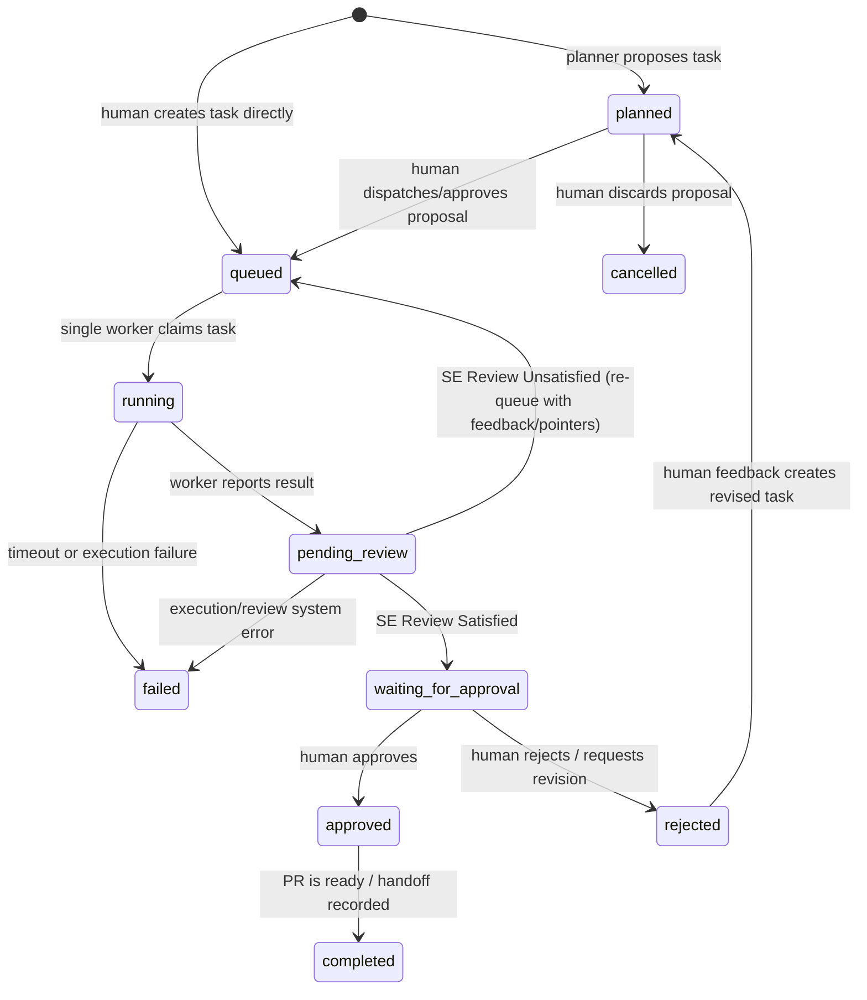

# MVP scope and success criteria

## The vertical slice to build

For one authenticated user and one connected GitHub repository, support this complete path:

```text
request -> planned task -> worker run -> AI review -> human approval/rejection
```

The UI needs only four useful screens:

1. **Project dashboard** — repository, context health, task list, and spend cap.
2. **New request** — a short objective plus optional instructions.
3. **Task detail** — plan, current state, live logs, files allowed to change, branch, live preview link, visual artifacts (screenshots/videos), test evidence, cost, and review.
4. **Approval view** — live preview URL, visual screenshot/video artifacts, changed files, GitHub diff/PR link, reviewer verdict, feedback box, approve/reject actions.

## Required capabilities

| Capability | MVP behavior |
| --- | --- |
| Project context | Ingest a repository tree and allow the user to maintain one project summary plus feature summaries. |
| Planning | Produce structured JSON for exactly one task: objective, rationale, allowed files, implementation plan, validation commands, and acceptance criteria. |
| Human control | The human explicitly dispatches the planned task and explicitly approves/rejects the final result. |
| Sequential execution | Only one task may be `running` for a project. A second task stays `queued`. |
| Worker | Clone the repository to a fresh directory, act only on the task, run checks, commit to a task branch, and return a report. |
| Review | Review the diff and worker evidence; report risks and a pass/fail/revise recommendation. |
| Live preview & visuals | Fetch the branch's Vercel Preview URL via GitHub/Vercel APIs and present it alongside Playwright UI screenshot/video artifacts for code-free inspection. |
| Audit trail | Persist prompts' metadata, task state changes, agent reports, test output, and Git branch/commit references. |
| Budget protection | Enforce a project run cap and show estimated per-run spend before dispatch. |

## Explicit cuts

Do not build these before the vertical slice works:

- Multiple coding workers or parallel execution.
- Streaming token-by-token chat.
- Automatic task decomposition into a graph.
- Agent-created external accounts or collection of arbitrary keys in chat.
- Codebase vector search or embeddings.
- GitHub merge from Axiom.
- User-defined Docker images, shell access, or an interactive terminal.
- Production tenancy, billing, teams, or RBAC beyond the demo user.

## Task lifecycle



The naming resolves the original ambiguity: 
* **`planned`**: The AI planner has proposed a task but it hasn't been dispatched by the human.
* **`queued`**: The task is waiting in the sequential queue (either created directly by the human or re-queued after a failed SE review).
* **`running`**: The active developer state inside the worker.
* **`pending_review`**: The automated Software Engineer (SE) reviewer agent evaluates the worker output and visual preview.
* **`waiting_for_approval`**: The SE reviewer was satisfied, and the task is now waiting for the human project manager's final approval/rejection.

## Acceptance criteria for the demo

- A new request becomes a structured task without manual database edits.
- The task visibly states the context used, allowed files, and validation commands.
- Dispatching a task creates exactly one branch and starts exactly one worker run.
- A known, small change is implemented and evidence is saved.
- The reviewer sees the actual diff and test output, not a model-generated summary alone.
- The UI prevents approval until review evidence exists.
- Rejecting a task saves human feedback and keeps the main branch untouched.
- The entire demo can be repeated using a small seed repository in under ten minutes.
