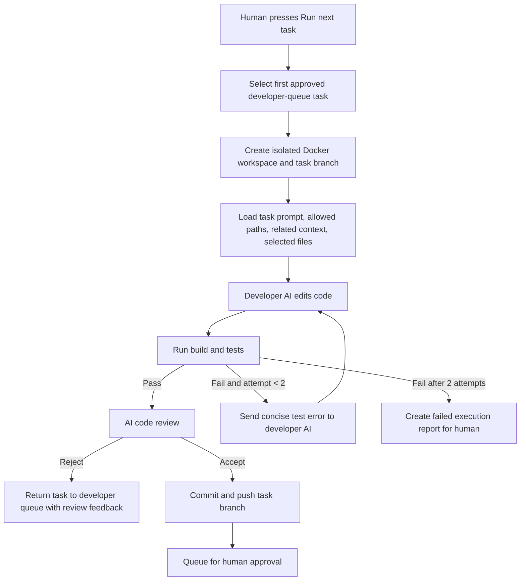

# Phase 3: Manual Docker Task Execution

## Goal

The human manually starts one approved developer-queue task. Axiom runs it in an isolated Docker workspace, validates the result, asks a separate AI reviewer to inspect the change, and only then places the result in a human-approval queue.

There is no automatic queue draining in this phase.

## Git strategy

Use one dedicated branch per task:

```text
axiom/task-<task-id-short>
```

Rules:

- The Docker worker checks out the repository default branch, then creates the task branch.
- It never commits or pushes directly to `main`/the default branch.
- After AI review accepts the change, the worker commits and pushes only the task branch.
- The human approves/rejects the branch change in Axiom before any later merge/PR action.

This makes every task reversible, reviewable, and safe for the demo.

## State flow



## Manual trigger and queue selection

- The UI exposes **Run next task** in the developer queue.
- It selects the first item ordered by category then priority: general tasks before feature tasks.
- Exactly one Docker worker may run at a time for the MVP.
- The button stays manual. No cron, event, or queue watcher starts work automatically.

## Inputs to the Docker worker

The orchestrator creates a short-lived execution manifest. The developer model receives only the information needed for the task:

```ts
{
  task: {
    id: string;
    developer_prompt: string;
    allowed_paths: string[];
    implementation_steps: string[];
    acceptance_criteria: string[];
    validation_commands: string[];
  };
  project_current_status: CurrentStatus;
  feature_current_status?: CurrentStatus;
  related_context_nodes: ContextNode[];
  selected_repository_files: Array<{ path: string; content: string }>;
  active_tasks: Array<{ id: string; category: string; state: string; objective: string }>;
}
```

The container may contain a full Git checkout so build tooling works, but enforcement is server-side:

- Reject a result whose `git diff` changes a path outside `allowed_paths`.
- Block secret files, `.env*`, private keys, and Git metadata from model-facing output.
- Truncate build/test logs before returning them to the model or UI.

## Docker workspace

One ephemeral container per manual run:

1. Obtain a short-lived GitHub App installation token restricted to the connected repository.
2. Clone the repository into an ephemeral workspace volume.
3. Create/check out `axiom/task-<id>`.
4. Mount a generated task manifest read-only.
5. Run the developer model command through a narrow runner interface.
6. Collect diff, command output, and report.
7. Destroy the container and workspace after artifacts are uploaded/saved.

The worker must not receive Supabase service credentials or the user’s Gemini key. It receives only the temporary repository token required for that run, preferably through a file or ephemeral environment variable.

## Developer loop: maximum two editing turns

Interpret the limit as at most two edit-and-validate attempts:

1. **Attempt 1:** developer AI reads the manifest and relevant files, edits code, then runs the task validation commands.
2. If validation fails, collect a concise sanitized error summary.
3. **Attempt 2:** send only the error summary plus existing task context back to the developer AI; it repairs the code and validates again.
4. If validation still fails, do not keep looping. Save a failed report and place the task in the human review queue as failed/blocked.

The developer model should not run arbitrary commands. The manifest provides allowed validation commands; the runner adds a small allowlist for package-manager/build commands needed by the project.

## AI review

Use a separate review call after validation passes. The reviewer receives:

- Original task objective and acceptance criteria.
- Allowed paths.
- Sanitized `git diff --stat` and diff content with a size cap.
- Validation results.
- Developer report.

The reviewer returns one of:

- `accept`: implementation satisfies the task and has no blocking issue.
- `reject`: return concise, actionable feedback. The task goes back to the developer queue; a human must manually run it again.

Review never edits code and never loops automatically.

## Developer report and status update

The existing structured `developer_report` is mandatory for every run. It records files, interfaces, config, behavior, validations, limitations, and handoff.

When the reviewer accepts, the task moves to a new `waiting_for_human_approval` state after its branch has been pushed. The task’s report and diff are shown to the human.

When the human eventually accepts the result, Axiom updates the affected project/feature `current_status` from the report:

- `code_snapshot` gets the files, interfaces, configuration, behavior, and validation results.
- `completed_work` gets a report-backed entry.
- `active_task` is cleared.
- The task becomes `completed`.

This update is not implemented until the human-approval/merge flow is designed.

## Database and UI changes required later

- Add task states: `waiting_for_human_approval` and, optionally, `review_rejected`.
- Add branch metadata: branch name, base SHA, head SHA, execution attempt count, execution timestamps.
- Store sanitized execution logs and a diff summary; do not put large diffs into the main task row.
- Add a branch/diff/report view to the human-approval queue.
- Add **Run next task** as the only execution trigger and keep it disabled until the runner is implemented.

## Build order

1. Define the execution/branch/report migration and UI placeholders.
2. Build the local Docker runner with a fake task manifest and no model call.
3. Add GitHub App clone/branch/commit/push flow with a test repository.
4. Add one developer-model edit attempt and command allowlisting.
5. Add the second attempt only for sanitized validation failures.
6. Add the separate AI reviewer and manual re-run path.
7. Add human approval, status update, and eventual merge/PR behavior last.
