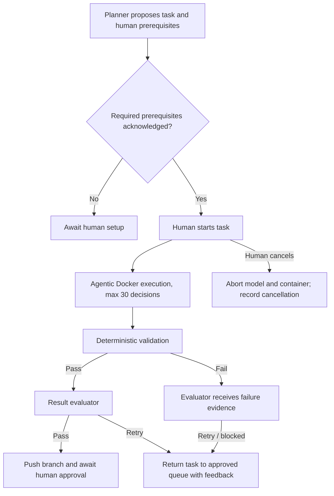

# Phase 4: Harness Hardening and Result Evaluation

## Goal

Turn the working manual ReAct developer harness into a demonstrably reliable workflow within its hard 30-decision-turn budget.

Phase 4 completes the work around the developer loop rather than changing its core goal: a human starts one approved task, Axiom works in an isolated branch, validates the result, evaluates it, and leaves the final merge decision to a human.

## Scope

Phase 4 includes:

- Applying and verifying the execution-progress/event migrations.
- Human-owned prerequisite actions proposed by the planner.
- A pass-or-retry evaluator with complete task and change evidence.
- Prompt cancellation of an active execution.
- Automated harness tests and a manual scenario matrix.
- Rate-limit resilience and execution observability verification.

Phase 4 does **not** include:

- Automatic queue draining.
- Automatic merge/PR creation.
- Agent-created external accounts, payment accounts, API keys, or secrets.
- Final model-tier selection. Model assignments are deliberately deferred until behavior is proven.

## Non-negotiable operating rules

- The developer has a hard budget of 30 decisions per task.
- The workspace tree is supplied before each decision, limited to depth 3 and excluding dependency/generated/secret paths.
- Writes, installs, scaffolds, migrations, and validation stay serialized.
- Independent file reads may run concurrently.
- A human retains approval over external accounts, credentials, production migrations, and branch merge.
- Secrets are never returned to a model, stored in task/event payloads, or displayed in the UI.
- Deterministic validation remains a required gate; AI evaluation supplements it and never replaces it.

## State flow



## 1. Verify execution persistence and activity streaming

### Required migrations

Apply and verify:

- `0008_react_execution_progress.sql` and `0010_raise_react_execution_budget_to_30.sql`: permit the 30-step execution budget.
- `0009_task_execution_events.sql`: stores structured per-tool execution events.

### Verification

Run one known-safe task and confirm:

- `tasks.execution_attempt_count` advances from 0 through the active turn.
- `task_execution_events` contains an ordered event for dependency preparation, tool calls, failures, and finish.
- The activity endpoint returns only events belonging to the authenticated user’s task/project.
- The UI updates the activity panel without a page-wide refresh.

### Acceptance criteria

- No task needs a new migration beyond `0008` and `0009` for Phase 4.
- Event payloads contain no `.env` value, private key, GitHub installation token, or raw secret.

## 2. Human prerequisite actions

### Purpose

The planner may identify required user-owned actions, for example:

- Run a named SQL migration in a chosen environment.
- Add a named variable to `.env.local` or a deployment secret store.
- Create/configure a payment provider account.
- Configure a webhook, OAuth redirect, domain, or repository permission.

The AI proposes these actions; it never performs them.

### Data contract

Evolve `human_actions` into structured checklist items while keeping existing records readable:

```ts
type HumanPrerequisite = {
  id: string;
  action: string;
  rationale: string;
  required: boolean;
  verification_guidance: string;
  status: "pending" | "acknowledged";
  acknowledged_at: string | null;
};
```

Only the action name and acknowledgement state are sent to the developer agent. Secret values are never included.

### UI and API

- Show prerequisites as a checklist on a proposed/approved task.
- Let the human acknowledge each item individually.
- Require explicit acknowledgement of every required item before **Run next task** is enabled.
- Allow optional items to remain pending.
- Record an auditable human event for each acknowledgement.

### Acceptance criteria

- A required unmet prerequisite blocks execution with a specific UI explanation.
- A developer prompt can state that a named prerequisite is acknowledged but cannot access its secret.
- A task may still run when only optional actions are pending.

## 3. Result evaluator: pass or retry

### Purpose

Evaluation answers one question: did this execution satisfy the approved task sufficiently to present its branch to the human?

It is not a second developer and must not edit files, run commands, or expand scope.

### Evaluator input

Pass only decision-relevant evidence:

```ts
{
  task: {
    objective: string;
    developer_prompt: string;
    allowed_paths: string[];
    acceptance_criteria: string[];
    validation_commands: string[];
  };
  project_current_status: CurrentStatus;
  feature_current_status?: CurrentStatus;
  before_after: {
    changed_paths: string[];
    diff: string;
    diff_stat: string;
  };
  execution: {
    final_validation: ValidationResult[];
    relevant_execution_events: ExecutionEvent[];
    developer_report: DeveloperReport;
  };
}
```

Do not send every intermediate edit or full repository contents. The evaluator sees the net before/after diff and evidence required to make the decision.

### Output contract

```ts
type Evaluation =
  | { verdict: "pass"; summary: string }
  | { verdict: "retry"; summary: string; feedback: string[] };
```

`retry` feedback must identify the unmet criterion, relevant path/diff evidence, and the smallest next action. It must not be generic advice.

### State transitions

- `pass` + passing deterministic validation → commit/push branch → `waiting_for_human_approval`.
- `retry` → preserve report/events, set task back to `approved`, attach feedback, and require a new manual run.
- deterministic validation failure → evaluator may explain it, but task enters retry/pending-review flow; it never becomes a pass.

### Acceptance criteria

- An implementation that builds but misses an acceptance criterion is retried.
- An implementation with a passing diff/validation and no criterion gap passes.
- The evaluator’s payload stays bounded and does not duplicate all intermediate code snapshots.

## 4. Active cancellation

### Problem

Archiving/resetting currently prevents eventual push but does not promptly stop an in-flight model request or Docker command.

### Design

- Keep a server-side active-run registry keyed by task ID.
- Store an `AbortController` for active Gemini calls and container identity for the Docker session.
- On archive/reset, set cancellation requested, abort the model request, terminate the container, and write a `cancelled` execution event.
- Check cancellation before every model decision, tool execution, validation, commit, and push.
- Treat cancellation as a user action, not an infrastructure failure.

### Acceptance criteria

- Cancelling a task stops active work promptly.
- No cancellation path commits or pushes a branch.
- The UI distinguishes cancelled from failed execution.

## 5. Automated test strategy

### Unit tests

- Native function-call parsing and invalid-call recovery.
- Only parallel `inspect_files` batches are accepted.
- Writes/commands/validation are serialized.
- The final decision turn permits only `finish_task`.
- 429 polling occurs at 5-second intervals and stops after 100 seconds.
- Workspace tree ignores dependencies, generated output, Git metadata, and secrets.
- Human-prerequisite gating allows only acknowledged required actions.
- Evaluator schema and state transitions.

### Integration tests with fakes

Use fake Gemini and Docker adapters. No test requires a real model API key or GitHub App token.

- Successful edit → validation → evaluator pass → push intent.
- Validation failure → evaluator retry → no push.
- Invalid tool calls recover without consuming the hard decision budget.
- Cancellation aborts execution and records the final event.
- Activity API returns ordered, project-authorized events only.

### Manual scenario matrix

| Scenario | Expected outcome |
| --- | --- |
| Existing React UI edit | Passing task in fewer than 20 turns |
| Dependency/config update | Lockfile/config change tracked and validated |
| Tailwind v4 styling edit | No legacy `init -p` path |
| Validation repair | Agent responds to actual failure and reaches a final result |
| Empty/foundation project | Scaffold succeeds in a non-empty clone without interactive cancellation |
| Allowed-path violation | Execution is blocked before commit/push |
| Impossible task | Clear retry/blocked result, no tool thrash |
| Rate limit | Retries every 5 seconds; stops after 100 seconds if still limited |
| Human cancellation | Container/model stop; no push |
| Required prerequisite pending | Run button remains unavailable |

## 6. Rollout order

1. Apply and verify migrations `0008` and `0009`.
2. Add automated fake-adapter coverage around the existing execution loop.
3. Implement the human prerequisite checklist and execution gate.
4. Expand the evaluator input/output contract and implement pass/retry state transitions.
5. Implement active cancellation and corresponding events/UI status.
6. Run the manual scenario matrix, fixing only reproducible failures.
7. Review actual cost, latency, and quota data; then choose final model tiers and concurrency limits.

## Definition of done

Phase 4 is complete when:

- A human can see and acknowledge required setup actions without exposing credentials.
- A completed execution is evaluated from task context plus net code change and validation evidence.
- The evaluator returns a bounded pass or retry result.
- An in-flight task can be cancelled promptly and safely.
- The 30-step developer budget is preserved.
- Rate limits recover briefly but do not hide daily quota exhaustion.
- Automated tests and the manual matrix demonstrate the listed safety and recovery paths.
