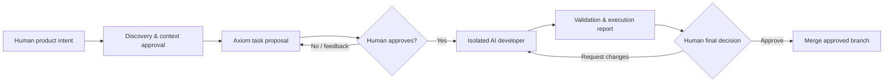

# Axiom


**Axiom is a human-controlled AI engineering harness.** It helps a product owner turn intent into a bounded engineering task, lets an isolated AI developer implement it, and returns the evidence needed for a human to decide whether to merge, revise, or stop.

Built for the [OpenAI Build Week Challenge](https://openai.com/build-week/).

**Live demo:** [axiom-ruddy-three.vercel.app](https://axiom-ruddy-three.vercel.app/)

## The problem

AI coding agents can move quickly, but shipping software still needs product judgment, clear boundaries, and accountable review. Axiom is designed for the gap between a vague product request and a trustworthy code change: it keeps humans in control of scope, approvals, credentials, and the final merge.

## What Axiom does

- Captures a structured project brief through a guided discovery flow.
- Synthesizes approved context into implementation-ready project knowledge.
- Proposes small, reviewable tasks from that context or from a direct request.
- Runs approved tasks in an isolated Docker workspace on a dedicated Git branch.
- Records agent activity, validation results, changed files, and developer reports.
- Brings every material decision back to the human: approve, request changes, answer a clarification, retry, or merge.

## How it works



The harness is deliberately human-in-the-loop: agents can inspect, plan, implement, and validate, but they do not autonomously merge or deploy.

## Built with

| Concern | Technology |
| --- | --- |
| Application and API | Next.js + TypeScript |
| Authentication, persistence, realtime | Supabase |
| Runtime AI developer | Google Gemini API with function calling |
| Hosted execution isolation | Docker on Google Cloud |
| Local execution isolation | Docker Desktop |
| Source control workflow | GitHub App and one branch per task |

I built Axiom as a solo developer with Codex and GPT-5.6 as active collaborators throughout the process. They helped me plan the architecture, iterate on the human-control workflow, implement and debug the application, and pressure-test execution, validation, Git, and safety boundaries. Product and technical decisions remained human-directed.

## Run locally

1. Install Node.js 22+, Docker Desktop, and npm.
2. **Launch Docker Desktop and wait until its engine is running before starting Axiom.** Local task execution needs the Docker daemon; the app cannot dispatch tasks without it.
3. Create a Supabase project and apply the migrations in [`supabase/migrations`](./supabase/migrations).
4. Copy `.env.example` to `.env.local`, then provide your Supabase, Gemini, and GitHub App credentials.
5. Install dependencies and start the app:

   ```bash
   npm install
   npm run dev
   ```

6. Open [http://localhost:3000](http://localhost:3000).

The GitHub App needs access to any repository Axiom will work on. Hosted task execution runs in Docker on Google Cloud; Docker Desktop provides the equivalent local execution environment.

## Deployment and branch review

It is recommended to deploy your repository on Vercel and use its preview deployments to view each task branch's changes before approving a merge. Connect the repository to Vercel, then open the preview generated for Axiom's task branch alongside the task report and validation evidence in Axiom. The current demo is deployed at [axiom-ruddy-three.vercel.app](https://axiom-ruddy-three.vercel.app/).

> Please don't burn my API limit :') Use a low-cost Gemini model while testing, keep task scopes small, and only run a task after reviewing its proposal.

## How to use Axiom

1. **Create a project.** Sign in, choose **New project**, and name the product you want to build.
2. **Connect the repository.** In project setup, select the GitHub repository Axiom may inspect and create task branches for.
3. **Complete discovery.** Answer the guided prompts about users, workflows, MVP scope, integrations, technical constraints, visual direction, and approval boundaries. Submit the brief when it reflects your intent.
4. **Review the context.** Let Axiom synthesize the discovery brief, then review and approve the context it will use to plan work. Answer any clarification questions before proceeding.
5. **Propose a task.** From the dashboard, ask Axiom to propose the next bounded task, or describe the outcome you want in **Propose task**. Review the objective, summary, and scope before approving it.
6. **Monitor execution.** An approved task enters the execution queue. Axiom prepares an isolated workspace, performs the bounded change on its own branch, and streams its activity and validation evidence to the dashboard.
7. **Make the final call.** Review the developer report, branch, changed files, and validation results. Choose **Approve & merge** to accept the result, or **Request changes** with feedback to send the task back for revision.

## Safety model

- All generated changes are untrusted until a human approves them.
- Work is isolated per task and tied to a dedicated Git branch.
- The human controls task scope, approval boundaries, execution, recovery, and merge decisions.
- Axiom stores secret references only; secret values belong in the deployment environment or a secrets manager, never task prompts, logs, database rows, or commits.
- State transitions and agent reports are auditable.

## Project documents

Supporting project documents are organized in [`docs/`](./docs):

- [Product brief](./docs/PRODUCT_BRIEF.md) — problem, users, and product thesis.
- [MVP scope](./docs/MVP_SCOPE.md) — vertical slice, exclusions, and acceptance criteria.
- [Architecture](./docs/ARCHITECTURE.md) — system boundaries, data model, execution flow, and safety model.
- [Build plan](./docs/BUILD_PLAN.md) — implementation and demo plan.
- [Budget](./docs/BUDGET.md) — cost model, limits, and service choices.

## Development checks

```bash
npm run lint
npm run typecheck
npm test
npm run build
```
