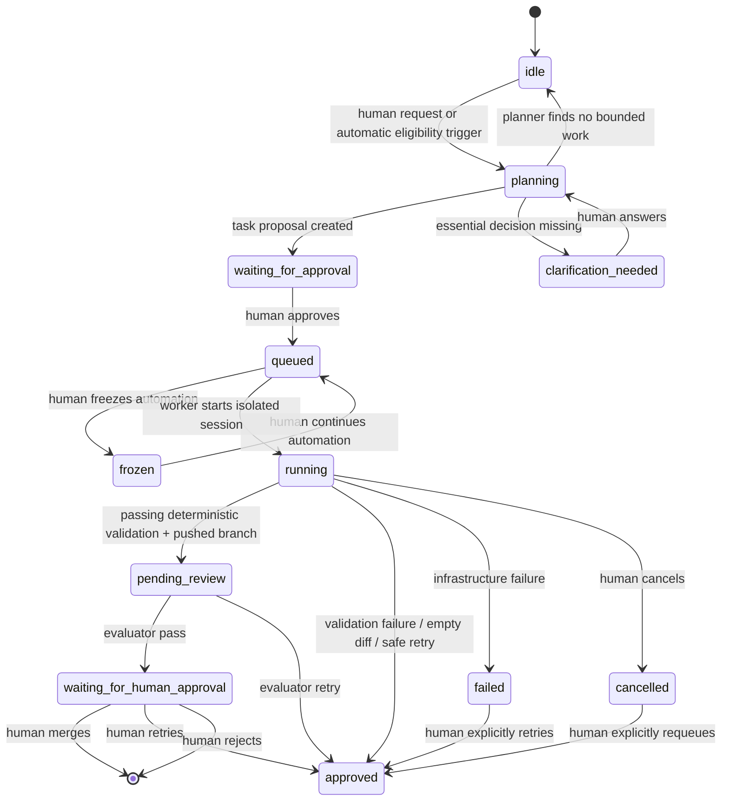

# Phase 5, Part 1: Controlled Automation

## Goal

Turn Axiom’s proven manual harness into a controlled background workflow that can
propose, execute, and evaluate bounded tasks without losing human control over task
approval, credentials, production operations, or merge decisions.

This phase uses the existing ReAct developer loop unchanged as the execution engine.
Humans may request work directly, while automation may propose a missing general or
feature task from bounded repository/context evidence. Every proposal still requires
human approval before execution. Automation decides when the next eligible queued task
may run and invokes the bounded bot evaluator after a successful execution.

## Non-goals

- Automatic task approval.
- The new product UI and visual redesign (Phase 5, Part 2).
- Automatic merge, deploy, production migration, external account creation, or
  secret entry.
- New per-turn concurrency behavior; Phase 4 already allows independent read-only
  inspections to run concurrently while serializing mutations and validation.
- Changing final model tiers before real automation data is available.
- Replacing the `/debug` harness console.

## Operating invariants

- One developer execution per project at a time, and initially one globally per
  Axiom worker process.
- The developer retains its hard 30-decision-turn budget; final validation remains
  harness-owned and is not an additional agent turn.
- Only independent read-only inspection calls may run concurrently inside a turn.
  Commands, writes, dependency installation, validation, commits, and pushes stay
  serialized.
- Required human prerequisites block execution until acknowledged.
- Deterministic validation failure, an empty diff, an allowed-path violation, or an
  cancelled run can never produce a reviewable branch.
- AI evaluation is `pass | retry`; it never edits, runs commands, or overrides a
  deterministic failure.
- A human approves task proposals and remains the only actor who merges a branch.
- Secrets, private keys, tokens, `.env` contents, and credentials never enter model
  context, event payloads, or activity APIs.

## Automation state machine



`cancelled` is a displayed execution outcome. If the current database stores it as
`failed` for compatibility, preserve a machine-readable cancellation reason until a
future state migration introduces a dedicated state.

## 1. Automation settings and eligibility

Add project-scoped automation settings:

```ts
type AutomationSettings = {
  state: "running" | "frozen";
  pauseReason: string | null;
  maxRunsPerDay: number; // conservative default, e.g. 3
};
```

The current implementation stores this as project-level automation columns. The
default is three automatic executions per project per database day; a lease claim
increments the counter atomically, so concurrent scheduler processes cannot exceed
the cap. Planning and AI review remain eligible after the execution cap is reached.

### Freeze / continue control

`Freeze automation` prevents the scheduler from claiming any new queued task for the
project. It does not interrupt an in-flight execution; human cancellation remains a
separate explicit action. `Continue automation` clears the pause and allows the next
eligible queued task to be claimed.

An automated execution is eligible only when all of the following are true:

1. Project context is approved and project automation is continuing (not frozen).
2. At least one approved/queued task exists.
3. No non-archived task is active. Active includes a running execution and every task
   with an existing branch awaiting bot evaluation, human approval, merge, retry, or
   rejection.
4. The project is not frozen and has no unresolved required clarification that blocks
   the queued task.
5. The daily run cap has not been reached.
6. The next task has no pending required human prerequisite and the scheduler is not
   in a provider-rate-limit cooldown.

Automation must write an auditable event for each skipped eligibility rule, but it
should coalesce repeated identical skips to avoid event noise.

The execution cap is enforced by the database lease-claim function, not merely by
the scheduler's preflight check. The preflight check exposes a clear idle reason to
the UI; the database is the concurrency-safe final authority.

### Proposal triggers

Task proposals have two triggers:

1. **Human-triggered proposal.** A human requests either a project-wide general task
   or a task for a selected feature.
2. **Automatic proposal.** The scheduler may ask the planner to decide whether a
   bounded task is warranted, using the normal planner inputs: approved project and
   feature context, current implementation status, repository map/file structure,
   eligible code evidence, existing task states, and recent outcomes.

Automatic proposal eligibility is intentionally narrow:

- **Feature proposal:** an active feature has no non-archived task related to that
  feature in any state (proposed, waiting for approval, queued, running, review, or
  branch-resolution states).
- **General proposal:** the project has no non-archived general task in any state.

The planner may propose exactly one task, ask a human clarification, or return a
typed `no_work` result. It must not invent work merely because the automatic trigger
fired. A valid proposal always enters `waiting_for_approval`; only a human can approve
it into the executable queue.

## 2. Scheduler and worker ownership

Introduce one server-side scheduler entry point. It can be invoked by a cron trigger,
an authenticated internal endpoint, or a manual “run automation cycle” action during
rollout. It performs no long-running work in the request that invokes it.

### Scheduler cycle

1. Acquire a durable project/task lease atomically.
2. Re-read eligibility after claiming the lease.
3. Select exactly one action in priority order:
   - evaluate a completed branch whose deterministic validation passed;
   - execute the oldest approved eligible task;
   - run one eligible automatic general/feature proposal check;
   - otherwise release the lease with a structured skip reason.
4. Dispatch the selected action to the durable worker/job mechanism.
5. Release or expire the lease when the job reaches a terminal result.

### Durable lease requirements

- Lease has `project_id`, optional `task_id`, `action`, `owner`, `claimed_at`, and
  `expires_at`.
- A second scheduler process cannot claim the same project while a valid lease exists.
- Worker heartbeats extend only its own lease.
- Expired leases are recoverable after a bounded timeout and leave an event explaining
  recovery.
- The existing in-process active-run registry remains the immediate cancellation
  mechanism; the durable lease solves restarts and multi-instance scheduling.

## 3. Action behavior

### Proposal and approval boundaries

- Humans may explicitly request a task, and automation may trigger a planner check
  only through the eligibility rules above.
- A feature may have at most one non-archived task across every state, including
  proposed, approved, queued, running, review, and branch-resolution states. The same
  one-task rule applies to general tasks.
- A human alone approves a proposed task into the executable queue.
- Planner clarifications remain human-owned and block the relevant task/feature until
  answered; they never cause automation to invent a substitute task.

### Auto-execute

- Claims the oldest approved, eligible task according to existing general-before-
  feature priority.
- Reuses `execute-next` orchestration through a shared service function, rather than
  having a second implementation for background work.
- Records `automation_started`, `automation_skipped`, `automation_completed`, and
  `automation_retry` events separately from tool events.
- A human archive/reset immediately aborts the active model request and Docker
  container, releases the durable lease, and prevents push.

### Bot evaluation, then human branch decision

- Runs only after passing deterministic validation and a successfully pushed branch.
- Reuses the existing net-diff evaluator input: task contract, approved status,
  changed paths/diff, validation result, bounded events, and final report.
- Bot `pass` moves the branch to `waiting_for_human_approval` and sends its bounded
  evidence/summary to the human. It does not merge or mark the task human-approved.
- Bot `retry` deletes the unaccepted branch, preserves report/events, attaches precise
  feedback, and returns the task to the executable queue, subject to its automatic
  retry cap.
- The human then chooses exactly one outcome for a bot-passed branch: merge, retry, or
  reject. Merge/reject are terminal branch decisions; retry returns the task to the
  executable queue, subject to its retry policy.
- Evaluation errors do not delete a branch; leave it `pending_review` for a human or
  a later retry.

## 4. Retries, rate limits, and stop conditions

### Provider rate limits

- Keep the existing model-call retry policy: retry every five seconds for up to one
  hundred seconds.
- If the limit persists, mark the job `rate_limited`, release its execution resources,
  and set a project cooldown rather than repeatedly restarting it.
- Scheduler resumes after the cooldown; it does not count provider-rate-limit waits as
  a developer attempt or task retry.

### Automation retry policy

- A deterministic validation failure or evaluator retry returns a task to `approved`
  but never auto-runs it again in the same scheduler cycle.
- Cap automatic re-executions per task (initially one after a retry). Further retries
  require human re-approval or an explicit human “retry once” action.
- Infrastructure failures, invalid model output, and expired leases require human
  acknowledgement before another automatic execution.
- Repeated command-policy rejections or evaluator failures pause project automation
  and surface a diagnostic event. Planner failures remain on the human-triggered
  planning path and do not start the queue runner.

## 5. API and event contracts

Create service-layer functions shared by manual and automated paths:

```ts
proposeNextTask(projectId, trigger: "human" | "automation")
executeTask(taskId, trigger: "human" | "automation")
evaluateTask(taskId, trigger: "human" | "automation")
runAutomationCycle(projectId?)
```

Each returns a typed result, not an HTTP response. Route handlers adapt those results
for the UI/debug console. This removes duplicated state transitions and makes fake-
adapter integration tests possible.

Add structured automation events:

```ts
type AutomationEvent = {
  action: "propose" | "execute" | "evaluate" | "skip" | "freeze" | "continue";
  trigger: "automation" | "human";
  reason?: string;
  leaseId?: string;
  taskId?: string;
};
```

Event payloads stay bounded and redact sensitive values using the same sanitizer as
execution logs.

## 6. Data changes

Plan migrations before implementation; do not apply them as part of drafting.

1. Project automation settings (JSON settings extension or normalized table),
   including frozen/continued state.
2. Durable automation leases/jobs with unique active-project protection.
3. Task metadata for `automation_attempt_count`, `last_automation_outcome`, and
   optional `automation_paused_at`.
4. Explicit cancellation state only if the existing `failed` compatibility encoding is
   insufficient for the final UI contract.

Migrations must be forward-only and preserve existing manual tasks/runs.

## 7. Observability and recovery

- Every scheduler decision has a reason visible through the existing activity/debug
  API.
- Expose counts for queued, running, paused, rate-limited, waiting-for-human, and
  retryable tasks; this is operational state, not product analytics.
- On process restart, reconcile durable leases against task state and Docker container
  identity before claiming new work.
- Never assume a push succeeded: verify branch/head SHA before moving to review.
- Manual controls always win over automation: pause, archive, reset, reject, and
  approve cancel or supersede queued automated actions.

## 8. Test plan

### Unit and fake-adapter integration

- Eligible/ineligible scheduler decisions and priority ordering.
- Atomic lease claim, expiry, heartbeat, and recovery.
- One active project execution across concurrent scheduler invocations.
- Human and automatic proposal triggers; a feature/general scope with any
  non-archived task cannot receive another proposal.
- Automatic planner returns proposal, clarification, or `no_work` without creating
  duplicate/noise tasks.
- Required prerequisite and clarification block automated execution.
- Deterministic failure/empty diff never pushes and does not immediately re-run.
- Evaluator pass and retry state transitions; evaluator error preserves branch.
- Rate limit produces cooldown without consuming task retry budget.
- Human cancellation wins during each action and releases the lease.

### Connected testrepo scenarios

1. Confirm automatic feature and general proposal checks run only when their scope has
   no non-archived task; confirm a human request obeys the same duplicate guard.
2. Confirm a proposal waits for human approval and never executes immediately.
3. Continue automation: confirm exactly one approved task runs and activity
   streams correctly.
4. Confirm bot evaluation: bot pass waits for a human merge/retry/reject decision,
   while bot retry returns the task to the queue.
4. Force a build failure: confirm no push and no immediate loop.
5. Force a temporary 429: confirm cooldown and later recovery.
6. Cancel a running task: confirm no branch push and no orphan lease/container.

## Definition of done

Phase 5 automation is complete when it can safely propose only missing general/feature
work, wait for human approval, run one eligible queued task through execution and bot
evaluation, then stop for a human merge/retry/reject decision; recover from a worker
restart/rate limit/cancellation; and respect freeze state—without duplicate work,
hidden retries, automatic approval, or automatic merges.
